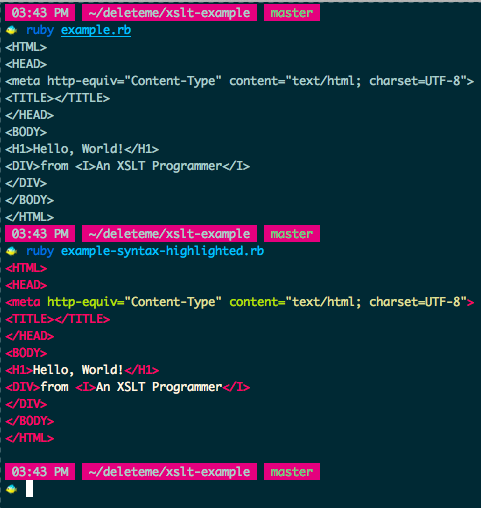

How to quickly play with XSLT
=============================

This is a small example showing how you can play around with XSLT, and see the result.
When I tried to learn XML in school, I couldn't figure out how to play with these things,

The hello world example is taken from [MSDN](https://msdn.microsoft.com/en-us/library/ms765388.aspx)

Other useful tools
------------------

Note that I've also got a script I use for prettifying xml, https://github.com/JoshCheek/dotfiles/blob/61aa83caeab3add887121ce7e3687d9df53cc3e1/bin/ppxml

License
-------

[do what the fuck you want to](http://www.wtfpl.net/about/)
